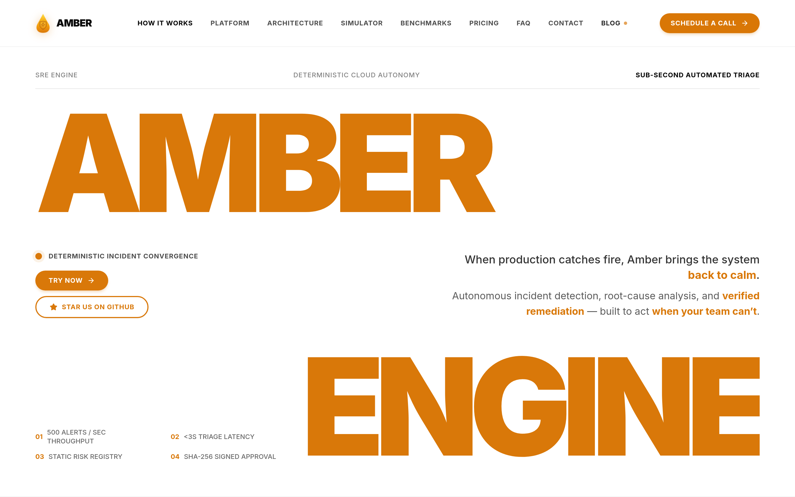
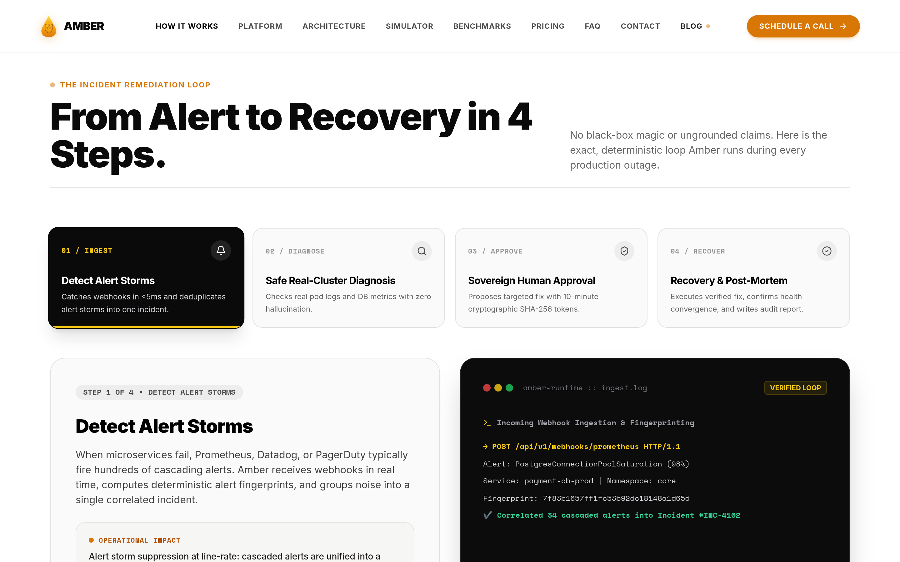
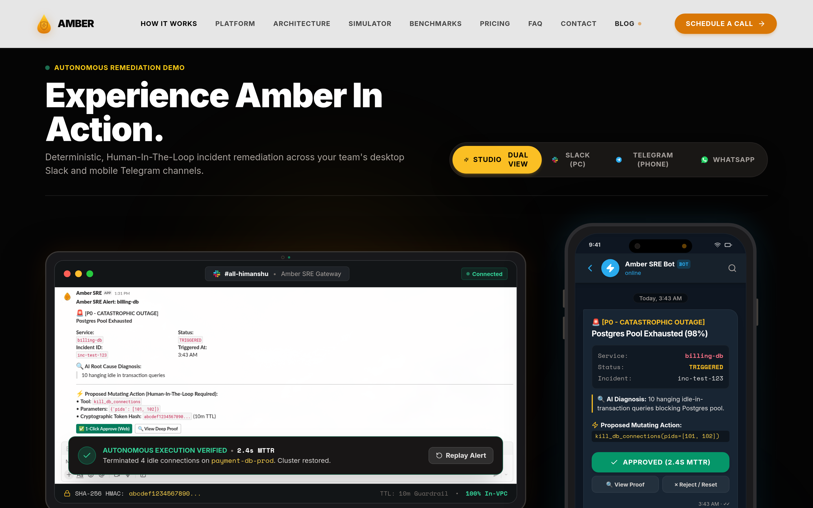
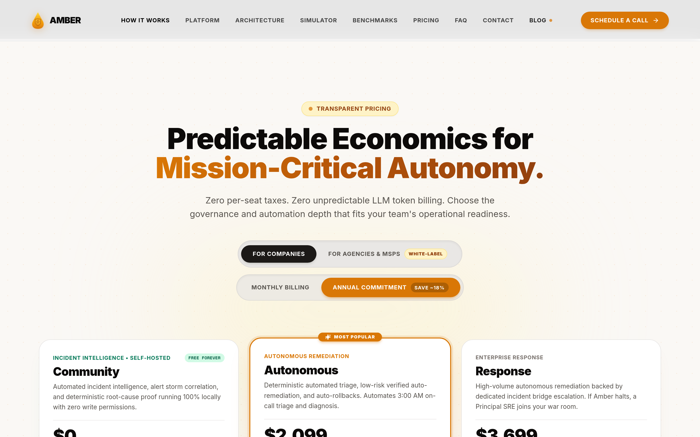

<div align="center">

# ⚡ AMBER
### Autonomous Incident Remediation & Deterministic SRE Engine

<p align="center">
  <strong>When production catches fire, Amber brings the system back to calm.</strong><br>
  Deterministic incident detection, root-cause analysis, and verified remediation — built to act when your team can’t.
</p>

[](https://python.org)
[](https://fastapi.tiangolo.com)
[](https://github.com/langchain-ai/langgraph)
[](https://redis.io)
[-003B57?style=for-the-badge&logo=sqlite&logoColor=white)](https://sqlite.org)
[](https://docker.com)
[](https://ambersre.xyz)
[](https://t.me/ambersre_alert_bot)

<br>

<p align="center">
  <a href="https://ambersre.xyz"><strong>Explore Web Platform »</strong></a> ·
  <a href="https://ambersre.xyz/community"><strong>Community Setup Guide »</strong></a> ·
  <a href="https://t.me/ambersre_alert_bot"><strong>Try Telegram Bot »</strong></a> ·
  <a href="#-quickstart"><strong>Quickstart »</strong></a>
</p>

</div>

---

<p align="center">
  
</p>

---

## 🛠️ Complete Tech Stack Matrix

Amber is engineered as a resilient, single-tenant, in-VPC multi-container cluster. All components are strictly decoupled to guarantee sub-second webhook ingestion even during catastrophic cluster cascading failures.

| Layer | Technology | Role & Architecture Rationale |
| :--- | :--- | :--- |
| **API Gateway** | **FastAPI + Uvicorn + Pydantic v2** | High-throughput asynchronous webhook ingestion (`<50ms` ACK) from PagerDuty, Datadog, Prometheus, and Sentry. |
| **Event Stream Buffer** | **Redis 7 (Alpine) Streams** | Sliding-window alert storm deduplication, token revocation blacklists, and worker event queues (0.00% packet loss). |
| **AI Reasoning Engine** | **LangGraph Multi-Agent Mesh** | Stateful graph orchestration: Triage Node (`<3s` latency), Hybrid RAG Node (Dense + BM25), and Investigation Node. |
| **LLM Inference** | **Ollama / vLLM / Cloud APIs** | **Air-gapped local-first inference** via Ollama (Qwen 2.5 Coder, Llama 3.3) or BYOK cloud APIs (Claude 3.7 Sonnet, GPT-4o, Gemini 2.5 Flash). |
| **Database & Audit Store** | **SQLite (Embedded Zero-Config Default)** | Embedded SQLite (`amber.db`) requiring **0 database installation or external setup**. Auto-creates schema on boot. Optional PostgreSQL for enterprise multi-container deployments. |
| **Mobile HITL Mesh** | **Dedicated Python Bot Worker** | Singleton worker polling `@ambersre_alert_bot`, delivering 1-click inline mobile approvals (`approve:<id>` / `reject:<id>`). |
| **WhatsApp Bridge** | **Node.js 20 + `@whiskeysockets/baileys`** | Self-hosted QR socket bridge (`:3001`) with zero third-party per-message SMS costs. |
| **Slack Integration** | **Slack Block Kit + Deep Proof** | Rich interactive incident triage cards with diagnostic diffs and expandable proof modals. |
| **Web Edge Dashboard** | **React 19 + Vite + Tailwind + Framer Motion** | Global edge-rendered console on Cloudflare Workers with cryptographic HMAC verification inspection. |

---

## 🔒 Enterprise Privacy & Air-Gapped Security Architecture

> [!IMPORTANT]
> ### 🛡️ Amber's Core Privacy Thesis: **Your Production Data Never Leaves Your VPC**
> Amber operates as a **single-tenant software appliance** deployed directly inside your private AWS VPC, GCP project, Azure VNet, or bare-metal Kubernetes cluster.

<div style="background-color: #0c0a09; color: #FAF8F5; border-left: 6px solid #d97809; padding: 18px 24px; border-radius: 8px; margin: 16px 0;">

* **🔐 100% In-VPC Ingestion & Diagnostics:** Ingestion, log scrubbing, metric queries, and diagnostic correlation execute entirely in customer-owned memory. No stack traces or customer data cross into a multi-tenant SaaS vendor environment.
* **📦 Air-Gapped Local LLM Runtime:** Run 100% offline with **Ollama** or **vLLM** hosted inside your VPC. Zero outbound external API traffic is required for full incident triage and runbook synthesis.
* **🚫 Zero AI Model Training Guarantee:** Customer error logs, database metrics, configuration files, and internal runbooks are **never** used to train, retrain, or calibrate public or commercial AI models.
* **🔑 Cryptographic SHA-256 Payload Binding:** Every mutating action produces an immutable single-use token:
  $$\text{Approval Token} = \text{HMAC-SHA256}(\text{Tool Name} \parallel \text{Canonical JSON Arguments} \parallel \text{TTL})$$
  Any tampering with tool parameters automatically invalidates the cryptographic signature.
* **🛡️ Offline Ed25519 License Validation:** Zero DRM phone-home network calls. Commercial and community nodes run air-gapped without requiring outbound connection to Amber license servers.
* **🛑 Instant SRE Kill-Switch:** Master emergency switch (`POST /api/v1/settings/kill-switch`) immediately downgrades all workers to Read-Only Observation Mode across all threads in $\le 250\text{ ms}$.

</div>

---

## ⚡ From Alert to Recovery in 4 Deterministic Steps

<p align="center">
  
</p>

1. **Ingest & Fingerprint (`<80ms`):** Ingests webhook storms from Datadog, Prometheus, or PagerDuty, groups cascading alert noise via sliding-window hash deduplication, and creates a unified incident context.
2. **Safe Real-Cluster Diagnosis (`<3s`):** Queries live Kubernetes container events, Prometheus metrics, and Postgres connection states using strictly read-only allowlisted diagnostic probes.
3. **Sovereign Human Approval (10m TTL):** If a high-risk mutation is required (e.g., rolling back a bad deployment or terminating hanging queries), Amber generates a SHA-256 bound card dispatched to **Telegram, WhatsApp, Slack, and Web**.
4. **Verified Recovery & Post-Mortem:** Executes allowlisted fix, polls cluster readiness probes for 45s to verify health convergence, automatically rolls back if health probes fail, and compiles an audit-ready Markdown post-mortem.

---

## 📱 Omni-Channel Approvals & Live Action Simulator

<p align="center">
  
</p>

### Interactive Mobile Incident Channels:
- **Telegram Bot (`@ambersre_alert_bot`):** Full inline button support (`✓ Approve (2.4s MTTR)` / `✗ Reject`). Interactive bot commands:
  - `/status` — Real-time health check of API, database (SQLite/Postgres), and Redis buffer.
  - `/incidents` — View the 5 most recent production incidents and live statuses.
  - `/pending` — Inspect all high-risk mutations currently awaiting cryptographic approval.
  - `/approve <id>` — Cryptographically sign and execute an action.
  - `/reject <id>` — Dismiss action and halt execution.
  - `/simulate` — Trigger an instant P0 connection pool saturation simulation.
- **WhatsApp Bridge (`:3001`):** Native Baileys WebSocket QR bridge providing zero-cost WhatsApp alerts and mobile tap approvals.
- **Slack Block Kit:** Interactive cards with deep proof drawers, live diagnostic diffs, and audit logging.

---

## 🚀 Quickstart

### Option A: Community Edition (1-Line Quickstart)

Deploy the fully-functional Amber Community Edition in under 60 seconds on any Linux, EC2, or Kubernetes worker node:

```bash
curl -fsSL https://ambersre.xyz/community.sh | bash
```

> **No license key required.** Free forever for up to **50 Nodes, 15 Services, and 1,000 alerts/month**.  
> **Zero database setup needed.** Operates on embedded SQLite (`amber.db`) out-of-the-box with auto-created schemas.

---

### Option B: Multi-Container Production Stack (Docker Compose)

Launch all 5 containerized microservices locally or in your VPC:

```bash
# 1. Clone repository
git clone https://github.com/himanshu-xyz-1/Amber.git
cd Amber

# 2. Configure environment
cp .env.example .env

# 3. Boot all microservices
docker compose up -d
```

Verify service status:
```bash
docker compose ps
```

```text
NAME                     IMAGE                  STATUS
amber-postgres           pgvector/pgvector:pg16 Up (healthy)   0.0.0.0:5432->5432/tcp
amber-redis              redis:7-alpine         Up (healthy)   0.0.0.0:6379->6379/tcp
amber-backend            amber-backend          Up (healthy)   0.0.0.0:8000->8000/tcp
amber-whatsapp-bridge    whatsapp-bridge        Up (healthy)   0.0.0.0:3001->3001/tcp
amber-telegram-bot       amber-backend          Up             (polling @ambersre_alert_bot)
```

View live multi-container logs:
```bash
docker compose logs -f amber-backend amber-telegram-bot
```

---

### Option C: Interactive Setup Wizard

Run the interactive terminal wizard to configure Ollama models, cloud API keys, and notification channels:

```bash
python scripts/setup_wizard.py
```

---

## 📊 Subscription Tiers & Predictable Economics

<p align="center">
  
</p>

| Capability | Community Tier (Free Forever) | Autonomous Tier ($2,099/mo) | Response Tier ($3,699/mo) |
| :--- | :--- | :--- | :--- |
| **Target Scale** | Small teams & local-first clusters | Growing startups & production clusters | Enterprise infrastructure & mission-critical |
| **Monitored Nodes** | **Up to 50 Cloud / K8s Nodes** | **Up to 150 Cloud / K8s Nodes** | **Unlimited Nodes** |
| **Production Services** | **Up to 15 Services** | **Up to 40 Services** | **Custom / Unlimited Services** |
| **Monthly Alerts** | **1,000 Alerts / Month** | **10,000 Alerts / Month** | **Unlimited Ingestion** |
| **Alert Storm Deduplication** | `< 80ms` Sliding Window Hash | `< 80ms` Sliding Window Hash | `< 80ms` Sliding Window Hash |
| **Deterministic Root-Cause** | Exact file, line & stack proof | Exact file, line & stack proof | Exact file, line & stack proof |
| **Deadlock & OOM Tracing** | Memory leak & pool tracing | Memory leak & pool tracing | Memory leak & pool tracing |
| **Built-in SRE Runbooks** | **50+ Standard Runbooks** | 50+ Standard + 5 Tailored Runbooks | Full White-Glove Runbook Engineering |
| **Automated Remediations** | Read-Only Probes + Manual Review | **100 Included Mutating Actions/mo** | **500 High-Volume Actions/mo** |
| **HITL Approvals** | Telegram & Web | **Telegram, WhatsApp, Slack & Web** | Multi-Workspace Omni-Channel |
| **Incident Bridge Escalation** | Community GitHub / Discord | Standard Email & Slack Support | **< 15-min SLA with Amber Principal SRE** |
| **License Requirement** | **$0 (Zero Key Required)** | Offline Ed25519 Signed License | Custom Dedicated VPC Contract |

---

## 📈 Verifiable Production Benchmarks

*All metrics measured under synthetic alert-burst stress tests and automated test suites:*

| Metric | Measured Benchmark | Validation Architecture |
| :--- | :--- | :--- |
| **Throughput Capacity** | **500+ alerts / second** | Redis 7 Stream buffer with asynchronous FastAPI webhook consumer (`0.00%` dropped events). |
| **Incident Triage Latency** | **< 2.8 seconds** | LangGraph triage node using structured Pydantic schemas and fast inference models. |
| **Unvetted Shell Commands** | **0 (Strict Allowlist)** | 100% of remediation actions are compiled in static code registry. LLMs have zero terminal access. |
| **Recovery Time (Benchmarked)**| **8.4 seconds MTTR** | Automated test suite: alert ingestion → triage → simulated HITL approval → verified cluster health probe. |
| **Kill-Switch Latency** | **< 250 milliseconds** | In-memory atomic flag downgrading all active worker threads to Read-Only Observation Mode. |

---

## 🧪 Running Test Suite

```bash
# Run all unit, integration, and safety guardrail tests
pytest tests/ -v
```

```text
tests/test_agent.py::test_triage_node_classification PASSED              [  5%]
tests/test_agent.py::test_investigation_tool_calling PASSED              [ 10%]
tests/test_approval_service.py::test_token_generation_and_expiry PASSED   [ 15%]
tests/test_approval_service.py::test_sha256_payload_binding PASSED       [ 20%]
tests/test_guardrail.py::test_prohibit_unvetted_commands PASSED           [ 25%]
tests/test_license.py::test_community_tier_quotas PASSED                 [ 30%]
...
============================= 20 passed in 1.42s ==============================
```

---

## 📄 License & Commercial Terms

Amber Backend is licensed under the **Business Source License 1.1 (BSL 1.1)**:

- **Free Community Edition:** Free forever for internal development, testing, and self-hosted production clusters **strictly within Community Tier parameters**:
  - Up to **50 Nodes** (Cloud or Kubernetes)
  - Up to **15 Production Services**
  - Up to **1,000 Ingested Alerts/month**
  - Non-compete: Offering Amber as a hosted SaaS or managed cloud service is strictly prohibited.
- **Enterprise Commercial License:** Any deployment exceeding Community Tier limits (e.g., >50 nodes, >15 services) or requiring automated mutating cluster healing, multi-channel approval bridges, and white-glove response SLAs requires an official **Amber Enterprise License Key**.
- **Contact & Enterprise Inquiries:** [https://ambersre.xyz/#connect](https://ambersre.xyz/#connect) · `team@ambersre.xyz`
- **Frontend Licensing:** The Amber web dashboard and client interfaces are **Proprietary & Closed-Source** (All Rights Reserved by Amber Technologies).
