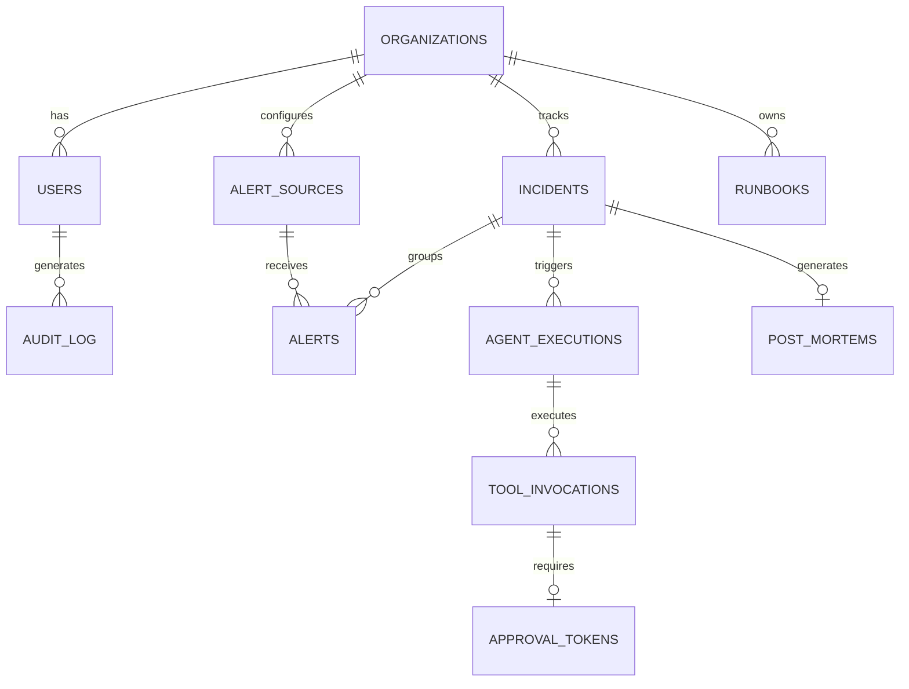

# Amber System Design: Database Architecture

## 1. Database Selection & Strategy

Amber employs a dual-tier database strategy designed for zero friction out-of-the-box while scaling to enterprise VPC workloads:

*   **Default Engine: Embedded SQLite (`amber.db`)**
    *   *Role:* Default zero-configuration engine for local development, Community Edition, and single-instance VPC nodes.
    *   *Why:* Zero external database server required; creates all tables on startup via SQLAlchemy async engine (`aiosqlite`). Perfect for fast evaluations, developer workstations, and edge deployments.
*   **Enterprise Engine: PostgreSQL 16 + pgvector (Optional Plug-in)**
    *   *Role:* Multi-container production clusters and enterprise VPC deployments.
    *   *Why:* Relational data model perfectly fits hierarchical structure (Org -> Incident -> Alert -> Tool Invocation). Strong consistency is non-negotiable for audit logs and execution states. Native JSONB support allows flexible storage for raw webhook payloads and agent states.
*   **Ephemeral State & Queuing: Redis 7**
    *   *Why:* Sub-millisecond latency for rate limiting, high-throughput Stream support for 500 alerts/sec ingestion buffer, and fast TTL-based storage for JWT blocklists.

### Decision Matrix

| Requirement | PostgreSQL | MySQL | MongoDB | Redis | Pinecone | Score/Winner |
| :--- | :--- | :--- | :--- | :--- | :--- | :--- |
| **Relational Integrity** | 5 | 5 | 2 | 1 | 1 | **PostgreSQL** |
| **JSON Support** | 5 | 4 | 5 | 2 | 1 | **PostgreSQL** |
| **Vector Search** | 4 (pgvector)| 1 | 2 | 3 | 5 | **PostgreSQL (pgvector)** |
| **Stream Processing** | 2 | 1 | 2 | 5 | 1 | **Redis** |
| **Op Simplicity** | 4 | 4 | 4 | 5 | 2 | **PostgreSQL + Redis** |

## 2. Schema Design

### Table Definitions

*   **`organizations`**: `id` (UUID, PK), `name` (VARCHAR), `plan_tier` (ENUM: starter, pro, enterprise), `stripe_customer_id` (VARCHAR)
*   **`alert_sources`**: `id` (UUID, PK), `org_id` (UUID, FK), `source_type` (VARCHAR), `webhook_secret` (VARCHAR), `config` (JSONB)
*   **`incidents`**: `id` (UUID, PK), `org_id` (UUID, FK), `fingerprint` (VARCHAR), `severity` (ENUM), `status` (ENUM: open, investigating, resolving, closed), `created_at` (TIMESTAMPTZ), `resolved_at` (TIMESTAMPTZ), `ttd` (INTERVAL), `ttr` (INTERVAL)
*   **`alerts`**: `id` (UUID, PK), `incident_id` (UUID, FK, Nullable initially), `source_id` (UUID, FK), `raw_payload` (JSONB), `fingerprint` (VARCHAR), `ingested_at` (TIMESTAMPTZ)
*   **`agent_executions`**: `id` (UUID, PK), `incident_id` (UUID, FK), `graph_state` (JSONB), `current_node` (VARCHAR), `started_at` (TIMESTAMPTZ), `completed_at` (TIMESTAMPTZ)
*   **`tool_invocations`**: `id` (UUID, PK), `execution_id` (UUID, FK), `tool_name` (VARCHAR), `args_hash` (VARCHAR), `result` (JSONB), `risk_level` (ENUM), `approved_by` (UUID, FK)
*   **`approval_tokens`**: `id` (UUID, PK), `tool_invocation_id` (UUID, FK), `payload_sha256` (VARCHAR), `expires_at` (TIMESTAMPTZ), `approved_at` (TIMESTAMPTZ), `approved_by` (UUID, FK)
*   **`runbooks`**: `id` (UUID, PK), `org_id` (UUID, FK), `title` (VARCHAR), `content` (TEXT), `embedding` (VECTOR(1536)), `version` (INT)
*   **`post_mortems`**: `id` (UUID, PK), `incident_id` (UUID, FK), `content` (TEXT), `status` (ENUM: draft, approved, indexed), `approved_by` (UUID, FK)
*   **`audit_log`**: `id` (UUID, PK), `user_id` (UUID, FK), `action` (VARCHAR), `resource_type` (VARCHAR), `resource_id` (UUID), `timestamp` (TIMESTAMPTZ), `ip_address` (INET)

## 3. Indexing Strategy

*   **B-Tree Indexes**: Standard for FKs (`org_id`, `incident_id`), timestamps (`created_at` for sorting), and exact matches (`fingerprint`, `stripe_customer_id`).
*   **GIN Indexes**: Applied to `alerts.raw_payload` and `agent_executions.graph_state` for fast arbitrary JSONB querying (e.g., finding alerts with specific tags).
*   **HNSW Indexes (pgvector)**: Applied to `runbooks.embedding` (using `vector_cosine_ops`). HNSW provides faster search speeds and better recall than IVFFlat for RAG retrievals under 3s triage NFR.

## 4. Connection Pooling

*   **PgBouncer**: Deployed in transaction pooling mode.
*   **Asyncpg**: FastAPI workers use `asyncpg` for non-blocking DB I/O.
*   **Pool Sizing Formula**: `(Number of CPU cores * 2) + Effective Spindle Count`. For a 16-core DB instance, target ~32-40 connections per PgBouncer pool.
*   **Max Connections**: DB max connections set high (~500), but PgBouncer throttles active transactions to prevent context-switching overhead.

## 5. Migration Strategy

*   **Tool**: Alembic (integrated with SQLAlchemy).
*   **Workflow**: Migrations are strictly forward-rolling in CI/CD. Destructive changes (drops, renames) must be deployed in multi-step phases (add column, dual write, migrate data, drop old column).
*   **Rollback**: Alembic down-revisions are tested locally, but in production, we prefer "fix-forward" scripts to avoid data loss.

## 6. Redis Data Structures

*   **Alert Ingestion (Streams)**: `amber:streams:alerts` -> Stores incoming webhooks temporarily. Maxlen = 100,000.
*   **Rate Limiting (Hashes/Counters)**: `amber:ratelimit:org:{org_id}:min` -> Tracks API requests. TTL = 60s.
*   **JWT Revocation (Strings)**: `amber:jti:{token_uuid}` -> Blacklists revoked tokens. TTL = JWT expiration time.
*   **Sliding Window Fingerprints (Sorted Sets)**: `amber:fingerprint:{hash}` -> Scores are timestamps to group alerts within a 5-min sliding window. TTL = 300s.

## 7. Backup & Disaster Recovery

*   **pg_dump**: Daily logical backups exported to encrypted S3 buckets.
*   **WAL Archiving**: Continuous archiving to S3 via `pgBackRest` enabling Point-In-Time Recovery (PITR) with RPO < 5 minutes.
*   **Redis Persistence**: AOF (Append Only File) configured to `everysec`. RDB snapshots every 15 minutes.

## 8. Data Retention & Archival

*   **Hot Storage**: `alerts` and `incidents` kept in main tables for 90 days.
*   **Partitioning Strategy**: `alerts` table is range-partitioned by month.
*   **Archival**: After 90 days, older partitions are detached, exported to Parquet format (via DuckDB/AWS Glue), stored in S3 Glacier, and dropped from PostgreSQL to maintain query performance.
