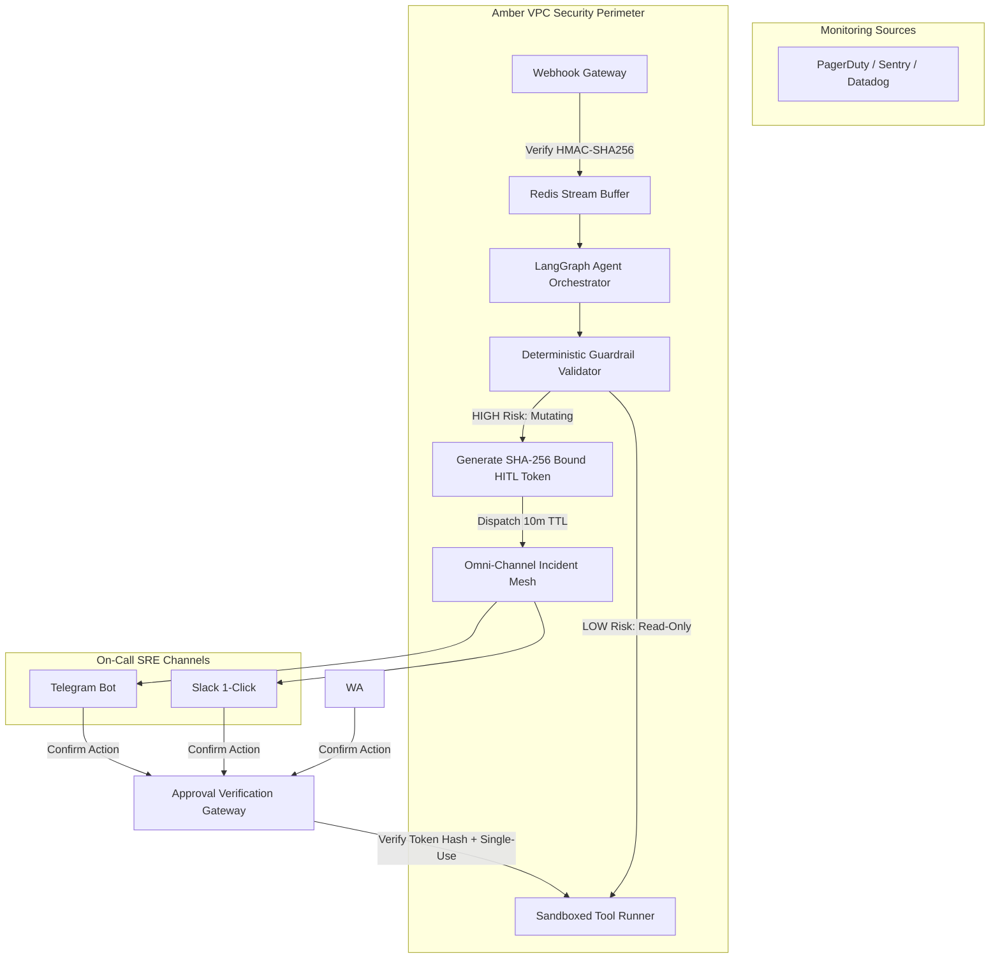

# Amber — Security & Token Architecture

## 1. Security Architecture Overview

Amber operates as a single-tenant, high-security autonomous SRE engine deployed directly inside customer VPCs or dedicated cloud infrastructure. Unlike traditional SaaS web applications, **Amber does not utilize a public user registration, username/password database, or browser session store.** 

Instead, Amber enforces a **Zero-Trust, Token-Bound Security Model** with four cryptographic layers:
1. **Inbound Webhook Authentication:** HMAC-SHA256 signatures for monitoring signals (PagerDuty, Datadog, Sentry, Prometheus, CloudWatch).
2. **Cryptographic HITL Action Tokens:** Single-use, SHA-256 payload-bound tokens with a strict 10-minute TTL for high-risk mutations.
3. **Machine-to-Machine Service IAM:** Scoped API keys and VPC IAM roles for target infrastructure execution.
4. **Anti-Replay & Token Revocation:** Redis-backed sliding window validation and non-repudiation audit logging.

---

## 2. Inbound Webhook Authentication (HMAC-SHA256)

External observability platforms ingest alerts into Amber via high-throughput webhook endpoints (`POST /api/v1/webhooks/{source}`).

* **Algorithm:** HMAC-SHA256 with per-source secret keys.
* **Header Verification:**
  - PagerDuty: `X-PagerDuty-Signature`
  - Datadog: `X-Datadog-Signature`
  - Sentry: `Sentry-Hook-Signature`
  - Generic/Prometheus: `X-Amber-Signature`
* **Anti-Replay Protection:** Webhook headers must include a timestamp (`X-Amber-Timestamp`). Requests with a clock drift > 300 seconds (5 minutes) are rejected immediately.
* **Zero Payload Modification:** Payloads are hashed and logged to immutable audit streams before LangGraph agent ingestion.

---

## 3. Cryptographic HITL Approval Tokens (Human-In-The-Loop)

When Amber's autonomous agents diagnose an incident requiring mutating infrastructure actions (e.g. killing database connections, pod restarts, deployment rollbacks), Amber **never executes autonomously without explicit cryptographic proof.**

### Token Specifications:
* **Payload Binding:** The approval token cryptographically binds the SHA-256 hash of the exact tool arguments:
  $$\text{Payload Hash} = \text{SHA-256}(\text{JSON.stringify}(\text{sorted}(\text{tool\_args})))$$
* **Strict TTL:** Hardcoded 10-minute expiry (`approval_expires_at = now() + 600s`).
* **Single-Use Invalidation:** Upon execution or rejection, the token ID (`jti`) is permanently written to Redis with a `RESOLVED` status, preventing replay attacks.
* **Tamper Proofing:** If an attacker intercepts the token and modifies even 1 character in the arguments (e.g. changing `pids=[412]` to `pids=[1]`), the SHA-256 check fails and execution is aborted instantly.

---

## 4. Role-Based Access Control (RBAC) & Service Personas

Access to Amber's management and incident interfaces is governed by machine-to-machine API keys and signed IAM role claims:

| Role / Persona | Operational Scope | Permitted Actions |
|---|---|---|
| **CTO / VP Eng** | Global Governance | Global kill-switch, audit log exports, MTTR telemetry, security policy changes |
| **SRE Lead** | System Administration | Runbook authoring, tool allowlist configuration, post-mortem indexing approval |
| **Service Dev** | Service Observer | Read-only incident timeline inspection for owned microservices |

---

## 5. Threat Model & Security Mitigations

| Attack Vector | Target Surface | Amber Architectural Mitigation |
|---|---|---|
| **Payload Tampering** | HITL Remediation | SHA-256 payload hash binding ensures arguments cannot be altered post-approval. |
| **Replay Attacks** | Webhook & Approval Tokens | 5-min clock skew check on webhooks; 10-min single-use TTL on approval tokens via Redis. |
| **Credential Exposure** | Target Cloud VPC | Zero credentials in LLM context; tool runner executes via short-lived AWS/GCP IAM roles. |
| **Prompt Injection** | LLM Diagnosis | LLM proposes tools, but **deterministic code guardrails** validate all commands against strict allowlists. |
| **Alert Flooding / DDoS** | Webhook Gateway | Redis Stream backpressure buffer with token-bucket rate limiting (500 alerts/sec capacity). |
