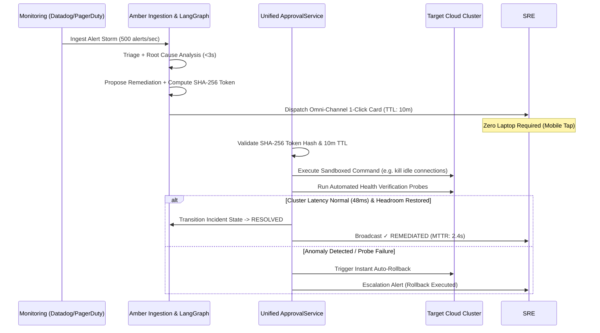

# Amber — Human-in-the-Loop (HITL) Permission & Verification Engine

## 1. Overview & Core Philosophy

Amber eliminates the need for on-call engineers to wake up, open laptops, authenticate via SSO portals, and manually type terminal commands during high-stakes outages. 

Amber operates on a **Governed Autonomous Model**:
1. **AI Proposes Diagnostics & Fixes:** Agents cluster alert storms, run read-only diagnostics, and generate the exact minimal-blast-radius remediation action.
2. **Deterministic Code Decides Safety:** Mutating actions (`HIGH` risk) are cryptographically signed into single-use approval tokens.
4. **Instant Verification & Auto-Rollback:** Once confirmed, Amber executes the action inside the VPC, runs automated health verification probes, and auto-rolls back if metrics don't recover in ≤ 5 seconds.

---

## 2. Omni-Channel Incident Mesh (Live Implementations)

Amber dispatches actionable incident cards simultaneously across configured channels:

### A. Telegram Bot Gateway (`amber-telegram-bot`)
* **Bot Username:** `@ambersre_alert_bot`
* **Worker Process:** Dedicated singleton polling container in `docker-compose.yml` (completely isolated from Uvicorn web workers to prevent 409 Conflict errors).
* **Interactive Commands:**
  - `/status` — Real-time health check of API, PostgreSQL, and Redis.
  - `/incidents` — View recent incident stream with severity badges.
  - `/pending` — List high-risk actions currently waiting for approval.
  - `/approve <id>` — Approve a pending remediation action.
  - `/reject <id>` — Reject a pending remediation action.
  - `/simulate` — Trigger an instant P0 connection pool saturation simulation.
* **1-Click Mobile Approvals:** Dispatches inline buttons (`InlineKeyboardButton`) with `callback_data="approve:<invocation_id>"` and `callback_data="reject:<invocation_id>"` for instantaneous mobile tap execution.

* **Live Endpoints:**
  - `GET /` — Web QR code display for quick phone linking.
  - `POST /send-alert` — Dispatches formatted Markdown alert cards and approval links directly to the on-call engineer's mobile device.

### C. Slack Interactive Block Kit (`backend/app/integrations/slack.py`)
* Dispatched to `#sre-critical` or service-specific triage channels.
* Interactive 1-Click `[Approve Action]` and `[Reject]` button elements.
* Expandable **Deep Proof** block containing:
  - Live diagnostic evidence strings (e.g., active connection counts, slow query PIDs).
  - Matched runbook snippet and confidence score.
  - Exact command mutation diff (`before` vs `after` state).

### D. Web Command Center (`https://ambersre.xyz`)
* Cloudflare Workers edge-deployed dashboard.
* Deep Proof drawer with interactive simulator, terminal streaming, and 1-click approvals.

---

## 3. Cryptographic Proof & Guardrail Specifications

Every HITL approval token is enforced by the **Unified Approval Service** (`backend/app/services/approval_service.py`):

1. **Deterministic Risk Stratification:**
   - **LOW Risk (Read-Only):** `query_db_metrics`, `fetch_pod_logs`, `check_service_health`. Executed autonomously under policy without human interrupt.
   - **HIGH Risk (Mutating):** `kill_db_connections`, `rollback_deployment`, `restart_service_pod`. Requires cryptographic human confirmation.
2. **Payload Hash Integrity:**
   - Token contains `payload_sha256 = SHA256(canonical_args)`.
   - The execution runtime verifies that the stored hash matches the inbound request before executing against cloud APIs.
3. **10-Minute TTL & Non-Replay:**
   - Tokens expire automatically after 600 seconds (`approval_expires_at`).
   - Expired tokens cannot be executed under any circumstances.
4. **Atomic State Resolution:**
   - Approving an action atomically transitions `tool_invocation.status` to `APPROVED`, records `approved_by` and `approved_at`, triggers execution, and updates `incident.status` to `RESOLVED`.
   - Rejecting an action marks it `REJECTED` and halts execution immediately.

---

## 4. Automated Post-Execution Health Verification

Execution of a remediation command is only the first half of incident resolution. Amber verifies cluster stability before declaring an incident resolved:

* **Automated Metric Verification:** Ingests p99 latency, connection pool saturation, error rates, and CPU/memory metrics.
* **Auto-Rollback Trigger:** If error rates exceed baseline or health probes return HTTP 5xx within 5 seconds post-execution, Amber immediately dispatches a pre-computed rollback command.
